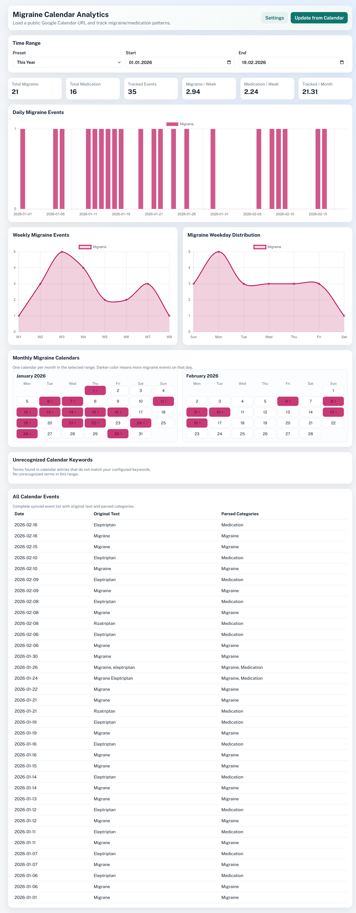
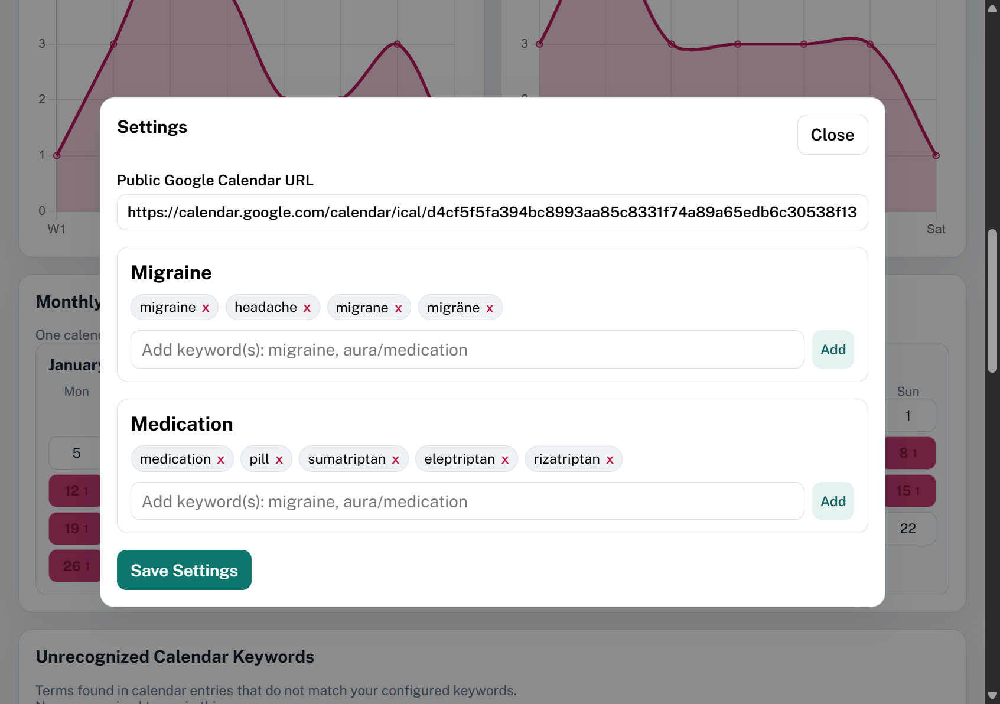

# Migraine Calendar Analytics

A simple personal dashboard for tracking migraine patterns from a public Google Calendar.

## Screenshot





## Usage

Visit [dankrusi.github.io/MigraineCalendarAnalytics](https://dankrusi.github.io/MigraineCalendarAnalytics) to use the app.
All data downloaded and stored locally in your browser.

You can also download the app as a standalone HTML file and just open it in your browser from your disk.

## What this app does

- Connects to a public Google Calendar
- Finds migraine- and medication-related events using your keywords
- Shows clear charts and calendar views so patterns are easy to spot
- Lets you filter by date range (past month, last 6 months, last year, this year, or custom)

## Main views

- Daily migraine chart
- Weekly migraine chart
- Migraine weekday chart
- Month-by-month migraine calendar view
- Unrecognized keyword list (to help improve your keyword setup)
- Full event list with date, original text, and parsed categories

## Quick start

### Option 1: Open directly from a folder (fastest)

1. Download or clone this project
2. Open the project folder
3. Double-click `index.html`

That’s it. The app runs directly in your browser.

### Option 2: Run with a local server (optional)

If you prefer:

```bash
python -m http.server 8080
```

Then open `http://localhost:8080`.

## First-time setup

1. Open **Settings** (opens automatically the first time)
2. Paste your public Google Calendar link
3. Add/edit keywords for your categories
4. Click **Update from Calendar**

## Notes

- Your settings and synced data are saved in your browser storage.
- Each update refreshes the local data so calendar edits/deletes are reflected.
- The calendar must be public.

## Tips

- Use several keywords for each category.
- You can add multiple keywords at once using:
  - comma `,`
  - semicolon `;`
  - slash `/`

## License

Add your preferred license here (for example MIT).
